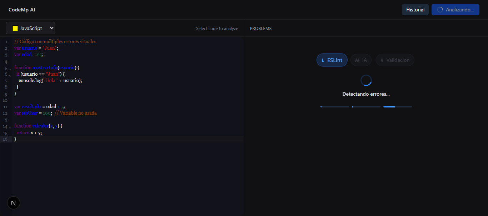
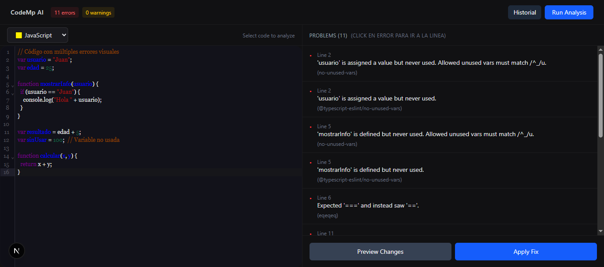
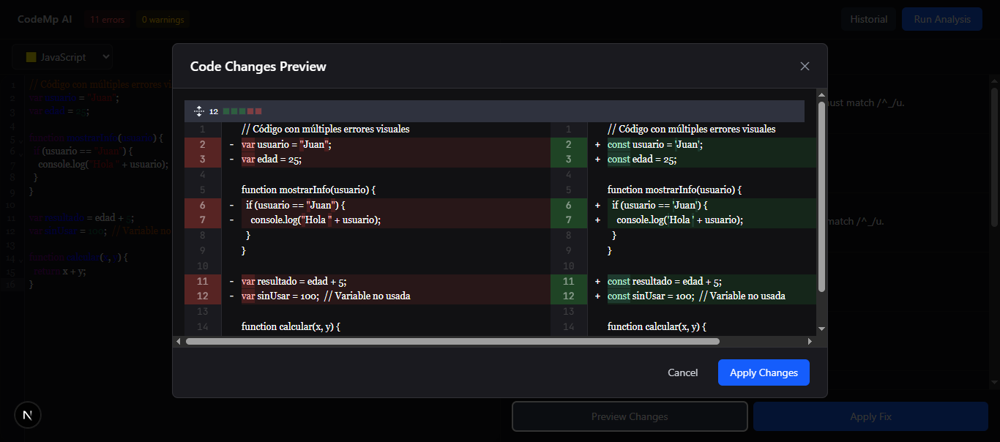
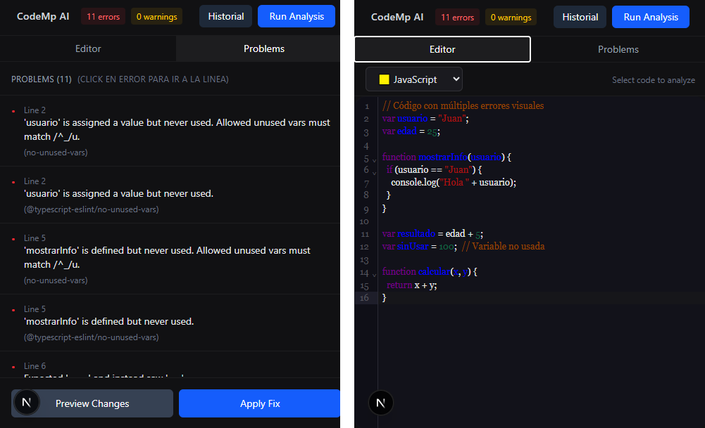
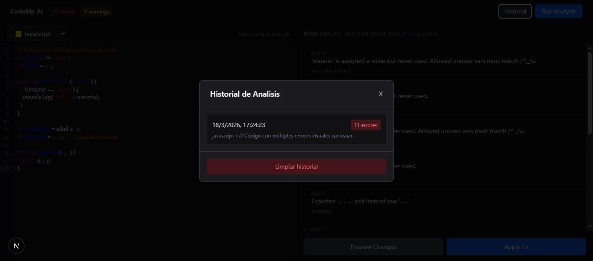
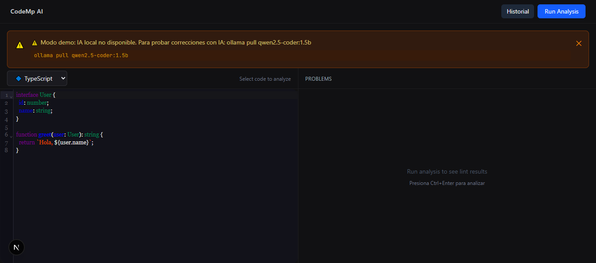

# CodeMp-AI


AI-powered code analysis and automatic code fixing tool that combines **ESLint** with a local AI model (**Ollama**) for intelligent suggestions.

[](https://nextjs.org/)
[](https://www.typescriptlang.org/)
[](https://eslint.org/)
[](https://ollama.ai/)
[](LICENSE)
[]()
[]()
[]()

## Demo

**Try it now:** [https://code-mp-ai.vercel.app](https://code-mp-ai.vercel.app)

> **Note:** The interface works online. AI requires local Ollama (see [Requirements](#requirements)).

## 💡 Why CodeMp-AI?

Demonstrates local AI (Ollama) integration with Next.js, including:

- 🤖 **Local models** - no external APIs or server costs
- 🎨 **Professional UX** with animated loading states (3 stages)
- 🛡️ **Smart validation** against AI errors
- 🚀 **Modern architecture** (Next.js 15, TypeScript, Tailwind)
- 🌐 **Demo mode** that works on Vercel without Ollama

## Features

- **Code editor** with support for TypeScript, TSX, JavaScript, and Python
- **ESLint analysis** with automatic fixes
- **Local AI with Ollama** for intelligent suggestions
- **Preview changes** before applying corrections
- **Persistent history** of analyses
- **Direct navigation** from errors to code lines
- **Responsive** for desktop and mobile
- **Demo mode** when Ollama is not available

## Requirements

- [Node.js](https://nodejs.org/) 18+
- [Ollama](https://ollama.com/download)
- Model `qwen2.5-coder:1.5b`

```bash
ollama pull qwen2.5-coder:1.5b
```

### Changing the Model

To use a different model, edit `frontend/app/api/analyze/route.ts` line 69:

```typescript
model: 'deepseek-coder:1.3b'  // Faster
```

| Model | Speed | Accuracy |
|-------|-------|----------|
| `deepseek-coder:1.3b` | 8-12s | Medium |
| `qwen2.5-coder:1.5b` | 15-25s | Good |
| `deepseek-coder:6.7b` | 30-45s | High |

## Installation

```bash
git clone https://github.com/MarceloAdan73/CodeMp-AI.git
cd CodeMp-AI/frontend
npm install
npm run dev
```

Open [http://localhost:3000](http://localhost:3000)

## Usage

1. Select a programming language
2. Write or paste your code
3. Press `Run Analysis` or `Ctrl+Enter`
4. Review errors in the right panel
5. Use `Preview Changes` to see diffs or `Apply Fix` to apply

### Keyboard Shortcuts

| Shortcut | Action |
|----------|--------|
| `Ctrl+Enter` | Analyze code |
| `Ctrl+H` | View history |
| `ESC` | Close modal |

## 📸 Screenshots

### Desktop

| Editor | Problems Panel | Changes Preview |
|--------|---------------|----------------|
|  |  |  |

### Mobile & History

| Mobile View | History | Demo Banner |
|-------------|---------|-------------|
|  |  |  |

> **Note:** For Vercel, set the `frontend` folder as the project root.

## ESLint Configuration

Rules enabled in `eslint.config.js`:

```javascript
rules: {
  semi: ['error', 'always'],
  quotes: ['error', 'single'],
  indent: ['error', 2],
  'no-var': 'error',
  'prefer-const': 'error',
  'no-unused-vars': 'error',
  'eqeqeq': ['error', 'always'],
}
```

## Project Structure

```
frontend/
├── app/
│   ├── api/
│   │   ├── analyze/route.ts    # API: ESLint + Ollama
│   │   └── health/route.ts     # Ollama health check
│   ├── page.tsx                # Main page
│   └── layout.tsx              # Root layout
├── components/
│   ├── CodeEditor.tsx          # CodeMirror editor
│   ├── DiffViewer.tsx          # Changes viewer
│   ├── AnalysisSkeleton.tsx    # Loading states
│   └── DemoBanner.tsx          # Demo mode banner
└── hooks/
    └── useTheme.tsx            # Theme provider
```

## 🗺️ Roadmap

- [ ] AI model selector in UI
- [ ] Support for more languages (Java, Go, Rust)
- [ ] Export reports (PDF/Markdown)
- [ ] Share code via URL
- [ ] Automated tests with Jest

## Technologies

- **Next.js 15** - React Framework
- **TypeScript** - Static typing
- **Tailwind CSS** - Styling
- **CodeMirror 6** - Code editor
- **ESLint 9** - Linting
- **Ollama** - Local AI engine
- **Framer Motion** - Animations

## Contributing

Contributions are welcome. Open an [issue](https://github.com/MarceloAdan73/CodeMp-AI/issues) or [PR](https://github.com/MarceloAdan73/CodeMp-AI/pulls).

## License

[MIT](LICENSE) - Marcelo Palma
